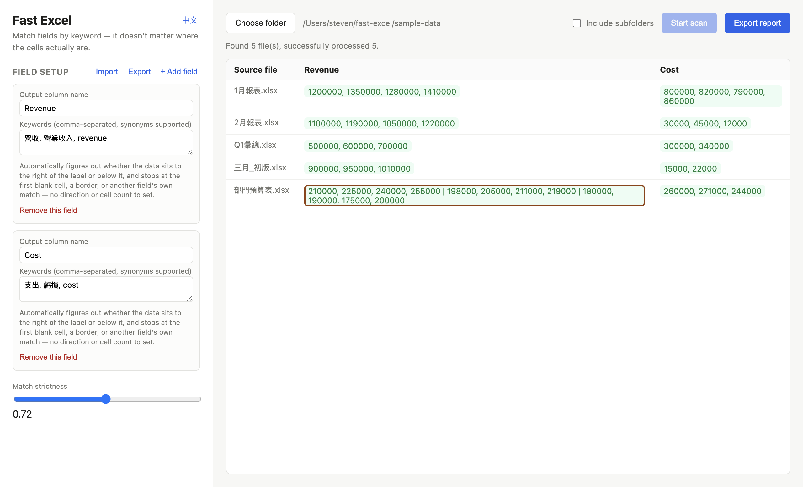
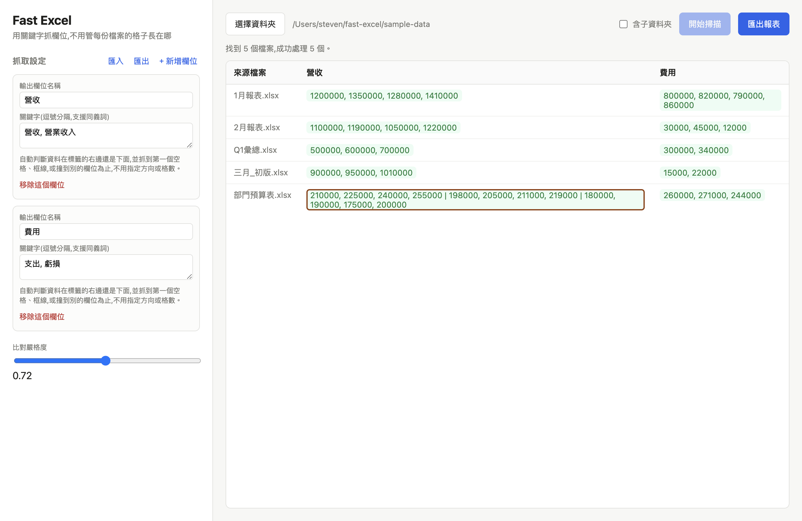

# Fast Excel

🌐 **English** | [繁體中文](README.zh-TW.md)

**Stop copy-pasting the same cells out of a folder of messy Excel/CSV reports every month.** Fast Excel finds your data by keyword, not by fixed cell position — so it doesn't matter that this month's revenue number moved from `B2` to `C5`, or that someone merged a title cell across four columns.

## Download

**No Node.js, no command line needed** — download the file for your system and install it directly:

| System | Download |
|---|---|
| Windows | **[FastExcel-win-x64.exe](https://github.com/steven10812122/fast-excel/releases/latest/download/FastExcel-win-x64.exe)** |
| Mac (Apple chip, M1/M2/M3/M4) | **[FastExcel-mac-arm64.dmg](https://github.com/steven10812122/fast-excel/releases/latest/download/FastExcel-mac-arm64.dmg)** |
| Mac (Intel chip) | **[FastExcel-mac-x64.dmg](https://github.com/steven10812122/fast-excel/releases/latest/download/FastExcel-mac-x64.dmg)** |
| Linux | **[FastExcel-linux-x86_64.AppImage](https://github.com/steven10812122/fast-excel/releases/latest/download/FastExcel-linux-x86_64.AppImage)** |

Not sure which Mac chip you have: Apple menu → "About This Mac" → the "Chip" line says either Apple (starts with M) or Intel.

**The first time you open it, your OS will push back — this is expected**, not a sign the file is broken (it's just not signed with a paid certificate):

- **Windows**: "Windows protected your PC" appears → click "More info" → "Run anyway"
- **macOS**: may say "is damaged and can't be opened" → open **Terminal** and run:
  ```
  xattr -cr "/Applications/Fast Excel.app"
  ```
  or: try opening it once (it'll be blocked), then go to System Settings → Privacy & Security, scroll down to the blocked-app notice, and click "Open Anyway"
- **Linux**: give it execute permission first, then double-click: `chmod +x FastExcel-linux-x86_64.AppImage`

## Screenshot




The UI is bilingual (English / 繁體中文), auto-detected from your OS language with a manual toggle in the top-left corner.

## What this is

Every month, someone opens 20 Excel files, hunts for the same handful of cells in each one, copies, and pastes them into a summary sheet for the exec report. It's boring, slow, and the layout is never quite consistent from file to file — one month the header is in row 1, the next it's in row 2 because someone inserted a row.

Fast Excel automates that hunt. You describe *what* you're looking for (keywords, with synonyms), not *where* it is — it figures out the "where" per file.

## Features

- Keyword + synonym matching, fuzzy (handles typos/rewording)
- Auto-detects how big the block is (a single value, a row, a column, or a full matrix) — nothing to configure by hand
- Preview results, manually re-anchor a wrong match, or exclude a field from export
- Reads **.xlsx, legacy .xls, and .csv**
- Recursive folder scan, with a progress bar and cancel
- Save your field setup as a file to share with a teammate or move to another machine
- Runs entirely locally — nothing leaves your machine

## Known limitations

- If two tables sit right next to each other with no blank, no border, and no header-line difference between them, there's no signal left to tell them apart automatically — use the manual override.
- Only one blank value is tolerated inside a block (bridging one missing month's data); two blanks in a row are treated as the real end of the table.
- A field whose match is a genuine 2D matrix in some files exports as one joined-text cell rather than spread columns.
- When the exact same phrase legitimately appears many times across a large multi-sheet workbook, the single best fuzzy-text match isn't necessarily the semantically correct one — see the real-world benchmark below. Manual override is the answer here, not a bigger threshold.
- .csv has no borders or merged cells at all, so 2 of the 5 boundary signals (border, merge) never apply to it — blank-cell, header/label-line, and cross-field-anchor detection all still work exactly the same as on .xlsx.

---

## For developers

The following is for people who want to modify the code, contribute, or build from source — regular users don't need to read past this point; the download links above are all you need.

### How the matching works

No manual cell ranges, no fixed "grab N cells" count. A field's range is auto-detected using five stacked signals, any one of which can end it:

1. **Blank cell** — the classic case, stop at the first empty cell.
2. **Deliberate border** — a medium/thick/double border marks a table edge even when the next cell isn't blank (e.g. an unrelated table sits right next to it). *(.xlsx/.xls only.)*
3. **Header/label line** — the row above (or column to the left) naming each real column is trusted over the data row itself, and can even bridge a single isolated missing value (one month's number is blank, but neighbors aren't).
4. **Another field's own anchor** — if two labels sit right next to each other with zero gap ("營收" then immediately "虧損"), the first field's range stops exactly where the second one's label starts.
5. **A merged, centered title** — if the label is a merged cell (e.g. `A1:D1`), its own span is used as the width/height directly, since that's the report author explicitly stating "this covers 4 columns." *(.xlsx/.xls only.)*

Direction (label-then-values-to-the-right vs. label-above-a-column-of-values) is auto-picked per anchor too — both are tried, and whichever finds more real data wins. When both directions found *something*, the result is flagged **ambiguous** in the UI so you can glance at it before trusting it.

None of this is a black box: click any result cell to see exactly which cell it matched, with what confidence, and the raw grid it pulled — and to manually override the anchor if it guessed wrong.

### Benchmark

`npm run benchmark` generates 24 files — two years of monthly reports for a fictional company, systematically cycling through every messy layout this engine handles (position drift, merged titles, borders with unrelated data glued on, zero-gap adjacent fields, missing values, legacy .xls, mixed English/Chinese labels, a formula-error cell) — then scans them with the real engine and checks every extracted value against the ground truth recorded at generation time.

```
Files:          24
Fields/file:    4
Time:           86 ms (3.6 ms/file)
Fields checked: 96
Correct:        96 (100.0%)
```

This is generated data with known-correct answers, not a claim about arbitrary real-world files. The point of committing the generator (`benchmark/generate.js`) rather than just the numbers is that anyone can regenerate and re-verify this themselves.

`npm run benchmark:real-world` is the real-world version: it downloads real 10-Q "Financial Report" Excel exports from SEC EDGAR for 10 well-known public companies (Apple, Microsoft, Tesla, Coca-Cola, Nike, Starbucks, 3D Systems, Boeing, Pfizer, AMD) — genuine filings, each with 40-50+ sheets, not generated — and matches Revenue/Cost/Gross Profit/Net Income by keyword despite every company using different terminology for the same line ("Net sales" vs "Revenue" vs "Net Operating Revenues" vs "Revenues").

Reported honestly, not cherry-picked: roughly 30 of 40 fields come back fully correct, several more are correct but with a stray label text prefixed to the real numbers (a real, open bug), and a handful are genuinely wrong or correctly reported as not found. The failures cluster in one specific, understandable place: filings where the exact same phrase ("Net income", say) legitimately appears many times across dozens of sheets — a subsidiary's net income, a note's net income, the consolidated total's net income — and the single best fuzzy-text match isn't necessarily the one on the primary income statement. Disambiguating "which of several textually-identical matches is the real one" needs more than keyword/structure matching; this is exactly the situation the preview + manual override exists for.

Running this surfaced two real engine bugs before it exposed that remaining limitation: a whitespace-only placeholder cell (common in machine-generated exports) wasn't being treated as blank, and a direction with no header/label line to answer to could win the auto-direction tie-break just by running unbounded through an ordinary column of line-item labels. Both are fixed and covered by regression tests.

`npm run benchmark:real-world-csv` does the same against a real **.csv**: Taiwan Stock Exchange's official open dataset of quarterly operating results, ~950 listed companies in one flat table — a genuinely different real-world shape (one wide table with many rows, instead of a few key line items per file), and one with no borders or merged cells at all, since CSV can't carry either. It matches all 4 fields correctly by header, but stops at row 463 of 1053: two insurance companies in a row (out of dozens scattered through the file with only some fields populated) have every field genuinely blank, which correctly triggers the "two blanks in a row ends the block" rule. That's defensible — stopping and letting you notice via preview beats silently plowing through a real gap — but it does mean this specific shape (thousands of rows, sparse real gaps throughout) isn't what the two-tolerated-blanks design center on; it was built around a handful of periods per line item, not a scan down thousands of rows.

### Build from source

Requires [Node.js](https://nodejs.org) 18+.

```bash
npm install
npm start        # run the app
npm test          # run the test suite
```

```bash
npm run dist:win     # Windows installer (.exe, NSIS)
npm run dist:mac     # macOS app (.dmg, Intel + Apple Silicon)
npm run dist:linux   # Linux (.AppImage)
```

Pushing a tag like `v0.1.0` also builds all three automatically via GitHub Actions (`.github/workflows/release.yml`) and attaches them to that tag's GitHub Release.

## License

MIT — see [LICENSE](LICENSE).
